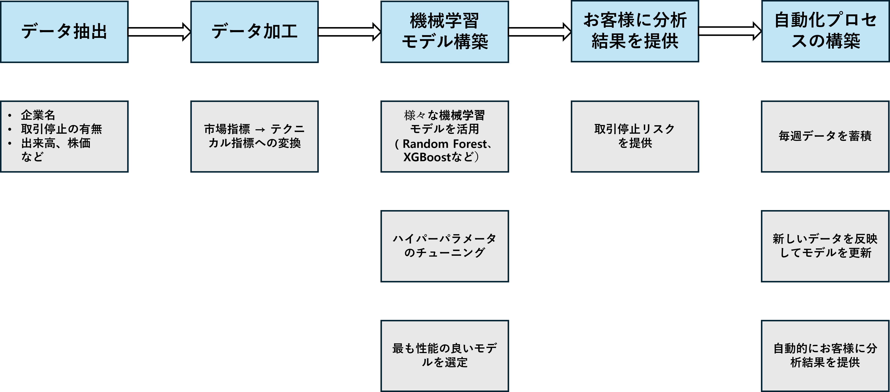
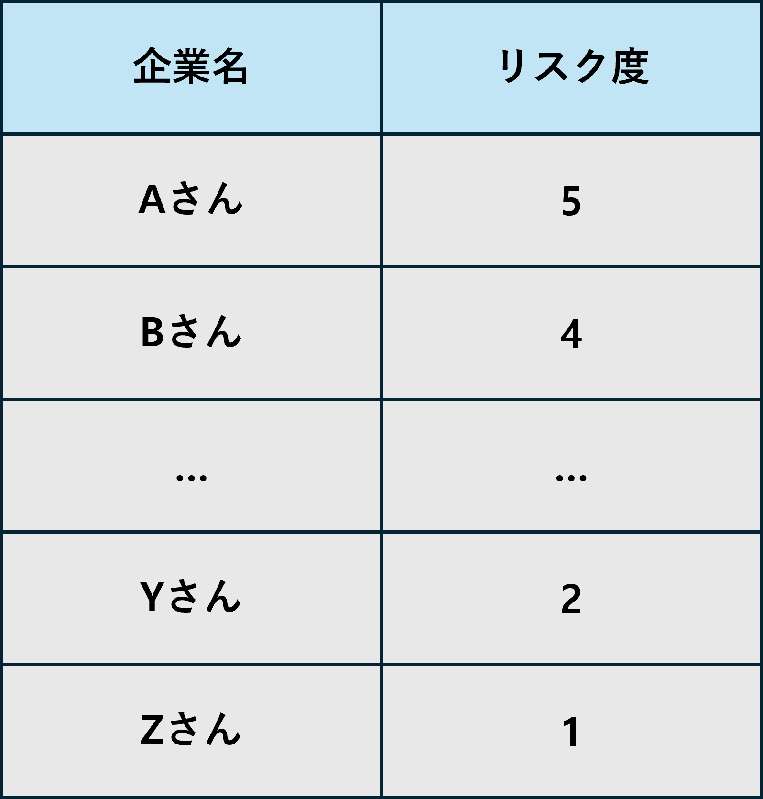

# 取引停止企業予測プロジェクト

## 📌 プロジェクト概要

本プロジェクトは、作為的な取引や異常な売買によって株式が**取引停止**となる企業を事前に予測することを目的としています。株価や出来高などの市場指標の異常な動きを技術的指標に変換し、**取引停止リスク度**として算出することで、投資家が損害を被るのを未然に防ぐことを支援します。

※ プロジェクトで使用されたコードは所属企業の資産であるため、公開できません。

---

## 💻 技術スタック

- **Database**: MySQL  
- **Programming Language**: Python  
- **Libraries**:  
  - Data Handling: `Pandas`, `NumPy`  
  - DB Connection: `PyMySQL`  
  - Machine Learning: `Scikit-learn`, `XGBoost`  
  - Visualization: `Matplotlib`, `Seaborn`

---

## 🗂 目次

1. [プロジェクト紹介](#1-プロジェクト紹介)  
   1.1 [背景](#11-背景)  
   1.2 [目的](#12-プロジェクト目的)  
2. [プロジェクトの詳細](#2-プロジェクトの詳細)  
   2.1 [データ抽出](#21-データ抽出)  
   2.2 [データ加工](#22-データ加工)  
   2.3 [機械学習モデルの構築](#23-機械学習モデルの構築)  
   2.4 [分析結果の提供](#24-分析結果の提供)  
   2.5 [自動化プロセスの構築](#25-自動化プロセスの構築)

---

## 1. プロジェクト紹介

### 1.1 背景

韓国株式市場では、**作戦勢力などの異常取引**により株式が取引停止となる事例が発生しています。このような場合、該当銘柄に投資している投資家は、売買ができず資金が拘束されるという大きな被害を受けることになります。

### 1.2 プロジェクト目的

- 株価や出来高などの**市場指標の異常な動き**を「リスク度」として定義  
- **取引停止のリスクが高い銘柄**を事前に特定し、警告を発信  
- 投資家の意思決定を支援し、損失を最小限に抑えるシステムを構築

---

## 2. プロジェクトの詳細

###   
> プロジェクトのワークフロー

### 2.1 データ抽出

- Pykrxが提供するデータを基に情報を収集  
- MySQLを通じて、企業名、市場指標（始値、高値、安値、終値、出来高）、取引停止の有無などのデータを抽出

### 2.2 データ加工

- `Pandas` や `NumPy` を活用し、分析に適した形式へと前処理を実施  
- 市場指標をMACD、RSIなどの**テクニカル指標**に変換するPythonコードを作成

### 2.3 機械学習モデルの構築

- `Random Forest` や `XGBoost` などの機械学習モデルを活用  
- `Train/Test`データに分割して性能を評価し、ハイパーパラメータをチューニング  
- 最終的に、最も性能が高いモデルを選定し活用

### 2.4 分析結果の提供

  
  
分析結果の例

- 各企業の取引停止リスク度を **1（最も安全）〜5（最も危険）** の5段階に分類し、ユーザーに提供  
- 投資家が直感的に理解しやすい形で結果を視覚化し提供

### 2.5 自動化プロセスの構築

- 毎週定期的に蓄積されるデータを反映するため、`Windowsタスクスケジューラ`と`Python`を活用し、**毎週土曜日の朝にモデルを自動で更新**するプロセスを構築  
- 分析結果は週ごとに更新され、ユーザーに提供される

