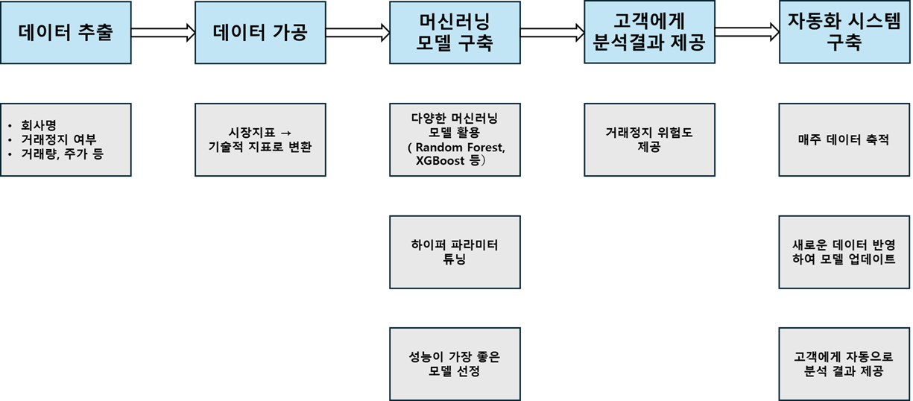

# 거래정지 기업 예측 프로젝트

## 📌 프로젝트 개요

본 프로젝트는 작전세력 등의 이상 거래로 인해 주식이 **거래정지**되는 기업을 사전에 예측하는 것을 목표로 합니다. 주가 및 거래량 등 시장 지표의 이상 움직임을 기술적 지표를 변수로 활용해 **거래정지 위험도**를 산출하고, 이를 통해 투자자들이 피해를 줄일 수 있도록 지원합니다.

※ 프로젝트에 활용된 코드는 회사 소속이므로 공개할 수 없습니다. 

---

## 💻 기술 스택

- **Database**: MySQL  
- **Programming Language**: Python  
- **Libraries**:  
  - Data Handling: `Pandas`, `NumPy`  
  - DB Connection: `PyMySQL`  
  - Machine Learning: `Scikit-learn`, `XGBoost`  
  - Visualization: `Matplotlib`, `Seaborn`

---

## 🗂 목차

1. [프로젝트 소개](#1-프로젝트-소개)  
   1.1 [배경](#11-배경)  
   1.2 [목표](#12-프로젝트-목표)  
2. [프로젝트 설명](#2-프로젝트-개요)  
   2.1 [데이터 추출](#21-데이터-추출)  
   2.2 [데이터 가공](#22-데이터-가공)  
   2.3 [기계학습 모델 구축](#23-기계학습-모델-구축)  
   2.4 [분석결과 제공](#24-분석결과-제공)  
   2.5 [자동화 프로세스 구축](#25-자동화-프로세스-구축)

---

## 1. 프로젝트 소개

### 1.1 배경

한국 주식 시장에서는 **작전세력과 같은 이상거래**로 인해 종종 주식이 거래정지되는 사례가 발생합니다. 이러한 경우, 해당 종목에 투자한 투자자들은 매수나 매도가 불가능한 상태가 되며, 투자금이 묶이는 큰 피해를 입게 됩니다.

### 1.2 프로젝트 목표

- **시장지표**(주가, 거래량 등)의 이상 움직임을 **위험도**로 정의  
- **거래정지 위험도가 높은 종목**을 사전에 식별 및 경고  
- 투자자의 의사결정을 돕고, 피해를 줄이는 시스템 구축

---

## 2. 프로젝트 설명

###   
> 프로젝트 workflow

### 2.1 데이터 추출

- Pykrx에서 제공하는 데이터를 기반으로 데이터 수집
- MySQL을 통해 회사명, 시장지표(시가/고가/저가/종가/거래량), 거래정지 여부 등의 데이터를 추출  

### 2.2 데이터 가공

- Pandas 및 NumPy를 활용해 분석에 적절한 형태로 데이터 전처리
- 시장지표를 기술적 지표(MACD, RSI 등)로 변환하는 Python 코드 작성

### 2.3 기계학습 모델 구축

- `Random Forest`, `XGBoost` 등 다양한 기계학습 모델 활용
- Train/Test set을 분리하여 성능 평가 및 하이퍼파라미터 튜닝  
- 최종적으로 성능이 가장 우수한 모델을 선정하여 사용

### 2.4 분석결과 제공

  
  
분석결과 제공 예시

- 기업별로 거래정지 위험도를 1 (가장 안전) ~ 5 (가장 위험)으로 나눠 고객에게 전달
- 투자자에게 직관적으로 제공할 수 있는 형태로 결과 전달

### 2.5 자동화 프로세스 구축

- 주기적으로 적재되는 데이터를 반영하기 위해, `Windows 작업 스케줄러`와 `Python`을 이용해 토요일 아침마다 모델을 자동 업데이트하는 프로세스 구축
- 분석 결과는 매주 갱신하여 고객에게 전달
